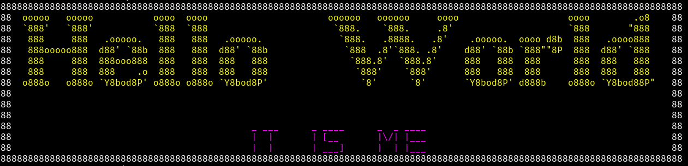

# Text Signature

## About

A Console App That Beautify Text with Currently Two Fonts:

- **Roman**
- **Medium**

That's it, really.

It's also made as a Project for [JetBrains Academy](https://www.jetbrains.com/academy/) Kotlin Basics Track, with few Customizations of my own 😎

**Original**

https://user-images.githubusercontent.com/61839948/210230837-343191b8-b9a2-4766-a618-d01f5a682808.mp4

**My Changes**
- Coloring Options 🎨
- Change Border Style 🔳
- Change Fonts ✍

## Demo

[Demo](https://user-images.githubusercontent.com/61839948/210418795-6a8e93fd-3f31-42c3-9956-6ba2e77d910e.mp4)

## How Can It Be Improved?

It would be Great If artistic people contributed by adding new fonts, as two fonts isn't really that much.